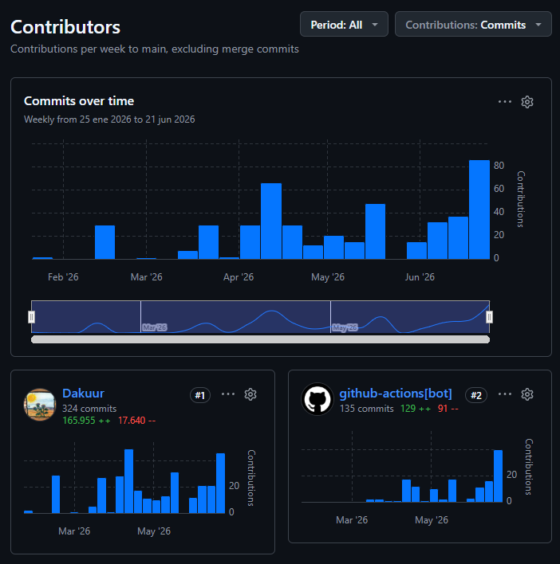

# Dossier del TFG

## Predicció de Metàstasi en Histopatologia en Càncer Colorectal usant Graph Attention Networks

**Autor:** David Morillo Massagué

**Tutora:** Debora Gil Resina (DCC)

**Centre:** Escola d'Enginyeria, Universitat Autònoma de Barcelona (UAB)

**Grau:** Enginyeria de Dades · Curs 2025/26

**Col·laboració:** Centre de Visió per Computador (CVC)

---

## 0. Sobre aquest dossier

Aquest document recull, de forma organitzada i accessible, tota la feina feta durant el TFG.

El dossier conté:

1. Un resum del projecte.
2. Les especificacions de les dades.
3. L'estudi de viabilitat.
4. Els diagrames d'anàlisi i disseny.
5. El disseny experimental.
6. El codi i el manual d'usuari (enllaç al repositori i instruccions d'execució).
7. La **llista de canvis**, que documenta tot allò que s'ha modificat al llarg del treball: l'evolució del projecte vista a través del repositori i els canvis suggerits per la tutora a les reunions.
8. La **declaració d'ús d'eines d'intel·ligència artificial**.

L'informe complet del projecte (l'article) s'adjunta a part i és el document de referència per als detalls tècnics. Aquest dossier el complementa, però no el repeteix.

---

## 1. Resum del projecte

El projecte construeix un sistema que, a partir d'una imatge de teixit (Whole Slide Image, WSI) d'un càncer de còlon en estadi inicial (pT1), prediu si el pacient té o no metàstasi als ganglis limfàtics (classificació N0/N1).

La idea de fons és senzilla: en lloc de tractar la imatge com un conjunt de píxels, es divideix en trossos petits (*patches*), es representa cada tros amb un vector de característiques i es connecten entre ells segons la seva posició real al teixit, formant un graf. Sobre aquest graf s'hi apliquen xarxes neuronals d'atenció (Graph Attention Networks) per decidir, finalment, si hi ha metàstasi o no.

L'interès és clar: podria ajudar a evitar cirurgies innecessàries, si el model és prou fiable. El projecte és exploratori i no substitueix cap diagnòstic clínic, però podria servir com a eina de suport a la decisió mèdica.

---

## 2. Especificacions de dades

**Repartiment de feina dins l'equip.** El projecte s'ha fet en col·laboració amb un equip de la UAB al CVC. La part anterior a la meva feina (obtenció de les WSI, extracció dels *patches* i càlcul de les característiques amb el model de fundació) la van fer altres membres de l'equip. **El meu punt de partida eren les característiques ja generades**; a partir d'aquí construeixo els grafs, el model i tota l'avaluació.

**Origen.** Les dades provenen de 26 hospitals, a partir d'imatges de làmines senceres de teixit (WSI) escanejades a alta resolució. Aquestes imatges originals i les seves anotacions són el material de partida del qual l'equip va extreure les característiques.

**Format d'entrada amb què treballo.** Rebia un arxiu per hospital (format `.npz`) que contenia, per a cada pacient i cada secció histològica, dues coses: les **coordenades** de cada tros de teixit i el seu **vector de característiques** (de mida `[1, 1536]`). Cada vector representa un tros de teixit; les coordenades serveixen per saber on és cadascun i poder-los connectar després.

**Etiquetes (diagnòstic per pacient).** A banda dels `.npz`, disposava d'un full de càlcul (Excel) amb el diagnòstic de cada pacient. D'aquí en treia l'etiqueta de classe: **N0** (sense metàstasi) o **N1** (amb metàstasi). Els pacients amb diagnòstic **NX** (estat ganglionar no avaluable o desconegut) es descarten, perquè no aporten una etiqueta vàlida per entrenar ni avaluar.

**De les característiques al graf.** El procés de preparació de dades fa un *join* (unió) entre les dades dels `.npz` (coordenades i vectors de característiques) i l'Excel d'etiquetes, casant cada secció amb el diagnòstic del seu pacient. Per a cada secció es construeix un graf espacial: cada tros de teixit és un node (amb el seu vector de característiques) i les arestes connecten els trossos veïns segons la seva posició real. El resultat es desa en **arxius de graf precomputats** (format `.pt` de PyTorch Geometric), un per secció, que ja contenen les característiques dels nodes, les arestes, les coordenades i l'etiqueta N0/N1. Així, els grafs queden llestos per entrar directament a la xarxa neuronal sense haver-los de tornar a calcular en cada entrenament.

**Dades efectives.** Després de descartar els casos sense diagnòstic vàlid o sense característiques generades, el conjunt final el formen uns centenars de pacients i més d'un miler de grafs (un per secció histològica). Les dues classes (amb metàstasi / sense metàstasi) estan clarament desbalancejades, fet que condiciona bona part de les decisions de disseny.

> *Nota: el detall numèric exacte del repartiment de dades i les particions es troba a l'informe (apartat de dades i a la taula del dataset).*

**Privadesa i ètica.** Les dades són clíniques i, per tant, sensibles, però totes les que s'han fet servir estaven anonimitzades: no contenien cap informació que permetés identificar els pacients. La feina s'ha fet sempre dins el marc de col·laboració amb el CVC i els hospitals que van cedir les mostres.

---

## 3. Estudi de viabilitat

**Viabilitat tècnica.** El projecte és viable amb eines de programari lliure i amb la infraestructura de càlcul del CVC. Les peces clau (extracció de característiques amb un model de fundació ja preentrenat, llibreries de grafs i d'optimització) estan disponibles i són madures, de manera que no cal desenvolupar res des de zero a baix nivell.

**Viabilitat temporal.** El treball s'ha pogut encaixar dins el calendari d'un TFG repartint la feina en fases: preparació de dades, construcció dels grafs, implementació del model, cerca d'hiperparàmetres i redacció. Les fases de càlcul més pesades (entrenament i cerca) s'han pogut paral·lelitzar i reprendre sense perdre feina.

**Viabilitat de dades.** Es disposa d'un volum de dades suficient per entrenar i avaluar, tot i que limitat per a conclusions clíniques definitives. Aquesta limitació es reconeix obertament i no impedeix assolir els objectius del treball.

**Camí cap a un ús real.** El sistema és una eina de recerca i de suport a la decisió, no un producte clínic: no es pot fer servir per prendre decisions sobre pacients reals sense una validació externa prèvia. Abans de poder aplicar-se en un hospital de veritat hauria de passar molts controls (validació externa, certificacions, etc.). A més, per ser útil cal que l'ordinador que la processa faci bé tots els passos anteriors a la diagnosi (extracció de *patches*, càlcul de característiques, construcció del graf...), perquè el model depèn que aquesta cadena funcioni correctament. Idealment també hauria de tenir un sistema d'interpretabilitat que ajudés el histopatòleg a identificar les regions crítiques per a la decisió. En aquest projecte aquesta part no s'ha acabat de perfeccionar, perquè l'objectiu central era construir un model sòlid amb bones mètriques i experimentar amb diferents arquitectures.

**Riscos principals i mitigació.**
- *Desbalanceig de classes* → es tracta amb particions estratificades, pesos a l'entrenament i un llindar de decisió ajustat.
- *Conjunt de test petit* → s'usa validació creuada per a la cerca i es reporten les limitacions de forma transparent.
- *Cost de càlcul* → s'aprofita infraestructura existent i es guarda l'estat de la cerca per poder reprendre-la.

---

## 4. Diagrames d'anàlisi i disseny

El disseny del sistema s'estructura en un pipeline de cinc blocs encadenats:

1. **Preprocessament:** de la WSI als grafs (extracció de *patches* → vector de característiques per *patch* → construcció del graf per proximitat espacial).
2. **Arquitectura:** capes de Graph Attention Network, amb dues variants comparades (una de senzilla i una amb agrupació jeràrquica).
3. **Readout:** lectura final del graf que el resumeix en un únic vector per secció (idèntica per a totes dues variants).
4. **Agregació per pacient (MIL):** es combinen les prediccions de les diferents seccions d'un mateix pacient.
5. **Decisió:** s'aplica un llindar per donar el resultat final N0/N1.

Els diagrames detallats (visió general del pipeline, comparació d'arquitectures, variants configurables i diagrama de flux complet) es troben a l'informe i als seus annexos. Aquest dossier només n'inclou la visió de conjunt.

> *[Espai reservat] Es poden incloure aquí les versions actualitzades dels diagrames un cop tancada la maquetació de l'informe.*

---

## 5. Disseny experimental

Aquest apartat recull les decisions preses per implementar i avaluar el sistema de manera rigorosa:

- **Esquema de partició de dades.** El conjunt es divideix en un *pool* (85%) i un test (15%), estratificats a nivell de pacient. El test s'aïlla des del principi i no intervé en cap decisió. Dins el *pool* es fa validació creuada (5-fold) per buscar els paràmetres de cada arquitectura; només per als millors models es fa un reentrenament 90/10 (90% per entrenar, 10% per aturar a temps) i s'avaluen les mètriques sobre el test inicial.
- **Gestió del desbalanceig de classes.** Particions estratificades, pesos a la funció de pèrdua per donar més importància a la classe minoritària, i un llindar de decisió ajustat per no deixar cap cas de metàstasi sense detectar.
- **Cerca d'hiperparàmetres.** S'utilitza una cerca bayesiana (Optuna, amb l'estimador TPE), amb una primera fase d'exploració aleatòria i després explotació de l'historial. Les dues arquitectures s'optimitzen en estudis separats.
- **Mètriques d'avaluació.** AUC, sensibilitat, especificitat, valor predictiu positiu i negatiu, amb la seva interpretació clínica.
- **Llindar operatiu.** Es prioritza no deixar passar cap cas positiu; el llindar es deriva del conjunt de validació, no s'optimitza com un hiperparàmetre més (és determinista).
- **Reproductibilitat.** Tots els experiments són reproduïbles gràcies a l'ús d'una llavor aleatòria fixa.

---

## 6. Codi i manual d'usuari

**Repositori.** El codi és públic i s'organitza en dos repositoris:

- **Repositori principal (propi):** `https://github.com/Dakuur/tfg`. Conté les eines personals de l'alumne: la memòria (LaTeX), el frontend de visualització i els *workflows* de CI/CD (compilació automàtica del PDF).
- **Submòdul (compartit):** `https://github.com/IAM-CVC/PT1Diagnosis` (branca `DavidMorillo`). És el codi del projecte fet conjuntament amb altres alumnes del CVC, i **és el que s'executa al servidor**: construcció de grafs, model i cerca d'hiperparàmetres. Aquest repositori és privat i, ara mateix, només hi tenen accés els membres de l'equip del projecte; cal demanar permís per consultar-lo.

**Manual d'execució.** S'assumeix accés al servidor del CVC, on hi ha les dades (`/mnt/iam/`) i la GPU. Els passos són:

1. **Clonar amb submòduls** (descarrega també el codi de `PT1Diagnosis`):
   ```bash
   git clone --recurse-submodules https://github.com/Dakuur/tfg
   ```
2. **Crear l'entorn i instal·lar dependències** (Python, PyTorch 2.5.1 + PyTorch Geometric):
   ```bash
   python -m venv .venv && source .venv/bin/activate
   pip install -r pt1diagnosis/sweep/requirements.txt
   ```
3. **Construir els grafs** a partir de les característiques del servidor (només cal un cop; genera el split estratificat i separa físicament el test):
   ```bash
   python pt1diagnosis/scripts_david/build_dataset.py
   ```
4. **Llançar la cerca d'hiperparàmetres** (Optuna; es pot aturar i reprendre, l'estat es guarda en disc):
   ```bash
   cd pt1diagnosis && python -m sweep
   ```
   Al clúster es llança com a treball SLURM encadenat (`scripts_david/sbatch_sweep.sh`).
5. **Reentrenar i avaluar el millor model** sobre el test:
   ```bash
   python -m sweep --finalize
   ```
6. **Explorar resultats i fer prediccions** amb el frontend web (model, mètriques i visualització del graf amb pesos d'atenció):
   ```bash
   ./frontend/start_frontend.sh      # http://localhost:8000
   ```

**Notes de disseny del codi.** El codi segueix un disseny modular: la construcció de grafs, el model, l'entrenament i la cerca d'hiperparàmetres estan separats, i la configuració es gestiona amb fitxers de text (YAML). La cerca es pot aturar i reprendre sense perdre feina.

**Monitoratge dels models (W&B).** Durant l'entrenament i la cerca d'hiperparàmetres s'ha utilitzat **Weights & Biases** com a servidor de monitoratge: registra les mètriques de cada *trial* en temps real (pèrdua, AUC, sensibilitat/especificitat), permet comparar configuracions i seguir el progrés del *sweep* des d'un panell web.

**Frontend web.** S'ha desenvolupat una interfície web pròpia per explorar el projecte de manera visual, que ofereix:

- **Visualització del WSI** amb superposició dels *patches* i la màscara anotada del teixit.
- **Visualització dels grafs** de Delaunay de tot el dataset.
- **Selector de model** que carrega qualsevol *checkpoint* dels *trials* de la cerca i n'infereix automàticament l'arquitectura a partir dels pesos.
- **Pestanya d'estadístiques** amb corbes ROC/PR, matriu de confusió i mètriques sobre el test.

---

## 7. Llista de canvis

Aquesta secció resumeix els canvis introduïts al llarg del treball: (7.1) l'evolució global vista al repositori i (7.2) els canvis derivats de les reunions amb la tutora.

### 7.1. Evolució del projecte (repositori)

El repositori acumula **~470 commits**. D'aquests, **~130 (≈28%) els genera un bot automàtic de CI/CD**: a cada canvi a l'informe, un workflow recompila `TFG.tex` i puja el PDF resultant (commits `actualizar PDF compilado [skip ci]`). La resta corresponen a feina pròpia, repartida entre model, article, eines/frontend i infraestructura.

La taula següent mostra, per a cada període entre lliuraments, on es va concentrar l'esforç. La intensitat resumeix el volum de canvis de cada tipus: ●●● intens · ●● moderat · ● puntual · – cap. El recompte de la fase inicial és baix perquè la recerca i l'experimentació prèvies (proves amb PyTorch Geometric) es van fer en local, encara sense repositori.

| Tipus de canvi | Feb<br>*(inici)* | Març | 1a quinz. abr | abr-maig | 1a quinz. juny | 2a quinz. juny |
|---|:---:|:---:|:---:|:---:|:---:|:---:|
| **Construcció de grafs i dades** (Delaunay, *patches*→node) | – | ●●● | ●● | ●● | – | – |
| **GAT** (arquitectura base, capes d'atenció) | ● | – | ●●● | ● | ● | – |
| **DiffPool** (agrupació jeràrquica de nodes) | – | – | ●●● | ● | ●● | – |
| **Readout** (lectura final del graf) | – | – | ●● | ●● | ● | – |
| **MIL** (agregació de seccions per pacient) | – | – | ●●● | ● | ● | – |
| **Cerca d'hiperparàmetres** (grid → Optuna/TPE) | – | – | ● | ●●● | ●●● | ● |
| **Article / memòria** (LaTeX, figures, redacció) | – | ●● | ●●● | ●●● | ●●● | ●●● |
| **Eines / frontend** (visualització, web) | – | ●● | ●●● | ●● | ● | – |
| **Infraestructura / CI/CD** (servidor, desplegament) | ●●● | ●● | ● | ● | ● | – |
| **Lliurament / fita** | Reunió inicial<br>(23 feb) | Informe inicial<br>(9 març) | Progrés I<br>(19 abr) | Progrés II<br>(24 maig) | Proposta inf. final<br>(14 juny) | Presentació (21 juny)<br>+ dossier (28 juny) |

**Lectura per fases:**

- **Febrer:** fase de recerca i experimentació (proves amb PyTorch Geometric en local, sense repositori), més la posada en marxa del servidor del CVC i les primeres proves del model GAT.
- **Març:** construcció del graf (Delaunay sobre patches), càrrega de dades reals i arrencada de la memòria amb CI/CD del PDF.
- **1a quinzena d'abril:** refactor modular del codi, DiffPool jeràrquic, predicció a nivell de pacient (MIL) i frontend de visualització.
- **Abril i maig:** cerca d'hiperparàmetres (grid i validació creuada), xifres reals del dataset i mètriques clíniques.
- **1a quinzena de juny:** cerca bayesiana (Optuna/TPE) amb estudis separats per arquitectura i resultats finals (Baseline vs DiffPool).
- **2a quinzena de juny:** polit final de l'informe, annexos, presentació i dossier.

Cal destacar que **l'informe final s'ha treballat des d'etapes molt anteriors al tancament del projecte** (ja des de març), i no només al final. Es va fer així per diversos motius: familiaritzar-se aviat amb LaTeX, tenir muntada des del principi l'estructura completa que tindria el document, i que la tutora pogués revisar-ne l'esquelet i l'evolució a cada reunió. Això explica que la fila d'article mostri activitat sostinguda al llarg de gairebé tot el projecte.



*Commits per setmana al repositori principal. Inclou tant la feina pròpia com els commits automàtics de compilació del PDF.*

### 7.2. Canvis derivats de les reunions amb la tutora

A partir del *feedback* sobre la proposta d'informe, els canvis principals van ser, a grans trets:

- **Estructura.** Es reordena el document perquè l'estat de l'art vagi abans dels objectius i es crea una secció de disseny experimental amb les decisions d'implementació.
- **Objectius.** Es redacta primer l'objectiu general i després els específics.
- **Estat de l'art.** Es reorganitza en blocs ordenats (guies clíniques → MIL → grafs en histopatologia → models de fundació) i s'amplia la relació amb el projecte.
- **Mètode i arquitectura.** Es reordena el pipeline (preprocessament → arquitectures → readout → agregació per pacient) i s'unifica el concepte de *readout* per a totes dues arquitectures.
- **Resultats i figures.** A les taules es deixen només mètriques de validació (per no suggerir selecció mirant el test); es revisen els gràfics i s'afegeix la corba ROC del millor model.
- **Estil i annexos.** Es retiren negretes innecessàries, es clarifiquen els diagrames i es reorganitzen els annexos (variants, hiperparàmetres, espai de cerca) per ajustar-se als límits de pàgines.

---

## 8. Declaració d'ús d'eines d'intel·ligència artificial

Tal com demana la normativa de l'assignatura, aquí s'indica quines eines d'IA s'han fet servir, per a què i fins a quin punt. En tots els casos han estat un suport formal o una ajuda tècnica puntual; les decisions de fons (plantejaments, mètodes, anàlisi i conclusions) són feina de l'alumne, juntament amb la tutora.

**Google Gemini (assistent de recerca, etapes inicials).** Es va fer servir al començament del projecte per documentar-se, aprofitant que està connectat a cerques de Google i que explora molta informació de forma ràpida. En concret, per a:

- Buscar articles relacionats amb l'objectiu i els mètodes del treball.
- Conèixer les mètriques actuals del diagnòstic del càncer colorectal (CRC).
- Fer una primera introducció als conceptes de les Graph Attention Networks (GAT).

**Claude Code (ajuda tècnica).** Es va fer servir com a suport durant la implementació, per a:

- Donar format al codi.
- Donar format a taules, figures i altres elements de LaTeX de l'informe.
- Muntar els primers experiments de model *end-to-end* i fer una primera revisió de si el codi funcionava, detectant *bugs*.
- Corregir errors puntuals (*bug fixing*).
- Crear el frontend web (JavaScript).

**Usos que no s'han fet.** No s'ha fet servir cap eina d'IA per a les parts que són el nucli del treball:

- Treure conclusions o interpretar els resultats.
- Proposar mètodes (MIL, *readout*, etc.) sense haver-ho consultat abans en articles o amb la tutora.
- Els plantejaments del treball.

